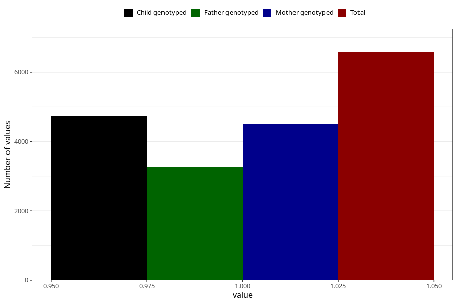

# nausea_21w_24w
Variable mapping to questionnaire: q3, question CC378.
- Number of values:

| Value | Total | Child genotyped | Mother genotyped | Father genotyped |
| ----- | ----- | --------------- | ---------------- | ---------------- |
| Missing | 107027 | 78136 | 67261 | 46949 |
| Non-missing | 6596 | 5219 | 4508 | 3269 |
| 1 | 6596 | 5219 | 4508 | 3269 |

