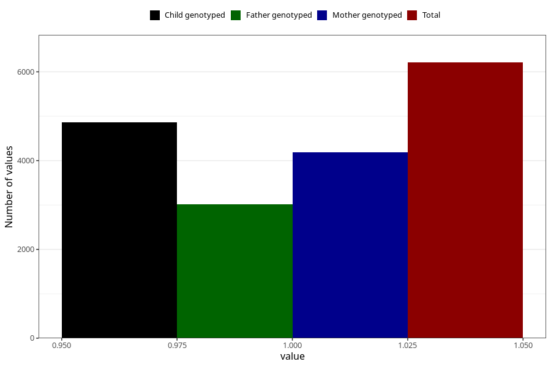

# nausea_25w_28w
Variable mapping to questionnaire: q3, question CC379.
- Number of values:

| Value | Total | Child genotyped | Mother genotyped | Father genotyped |
| ----- | ----- | --------------- | ---------------- | ---------------- |
| Missing | 107413 | 78496 | 67577 | 47209 |
| Non-missing | 6210 | 4859 | 4192 | 3009 |
| 1 | 6210 | 4859 | 4192 | 3009 |

