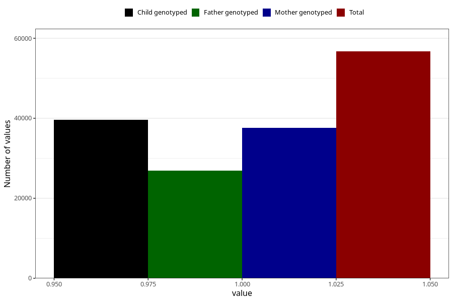

# nausea_5w_8w
Variable mapping to questionnaire: q1m, question AA217.
- Number of values:

| Value | Total | Child genotyped | Mother genotyped | Father genotyped |
| ----- | ----- | --------------- | ---------------- | ---------------- |
| Missing | 56912 | 39947 | 34112 | 23316 |
| Non-missing | 56711 | 43408 | 37657 | 26902 |
| 1 | 56711 | 43408 | 37657 | 26902 |

