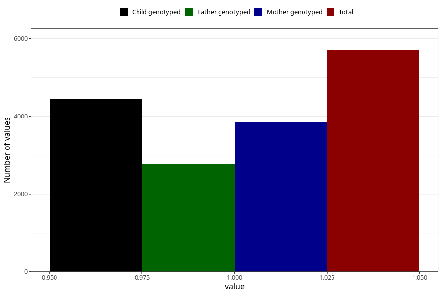

# nausea_after_29w
Variable mapping to questionnaire: q3, question CC380.
- Number of values:

| Value | Total | Child genotyped | Mother genotyped | Father genotyped |
| ----- | ----- | --------------- | ---------------- | ---------------- |
| Missing | 107922 | 78910 | 67916 | 47449 |
| Non-missing | 5701 | 4445 | 3853 | 2769 |
| 1 | 5701 | 4445 | 3853 | 2769 |

