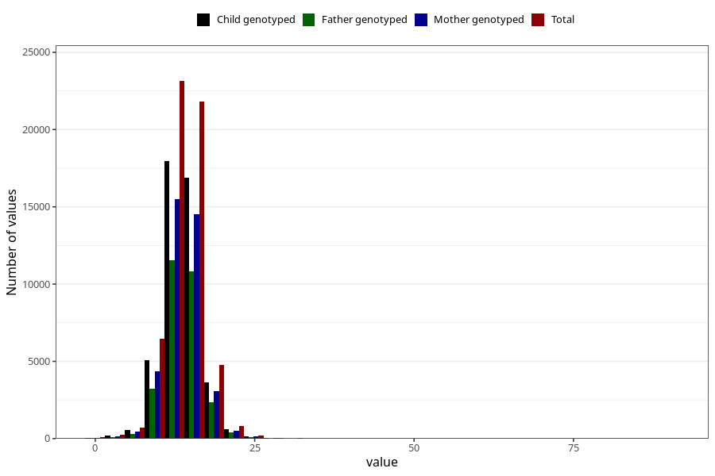

# nausea_week_most_bothered_to_q2
Variable mapping to questionnaire: q2_cwd, question BB854.
- Number of values:

| Value | Total | Child genotyped | Mother genotyped | Father genotyped |
| ----- | ----- | --------------- | ---------------- | ---------------- |
| Missing | 55263 | 34487 | 32904 | 21217 |
| Non-missing | 58360 | 40944 | 38865 | 29001 |
| 25th percentile | 12 | 12 | 12 | 12 |
| 50th percentile | 13 | 13 | 13 | 13 |
| 75th percentile | 15 | 15 | 15 | 15 |

