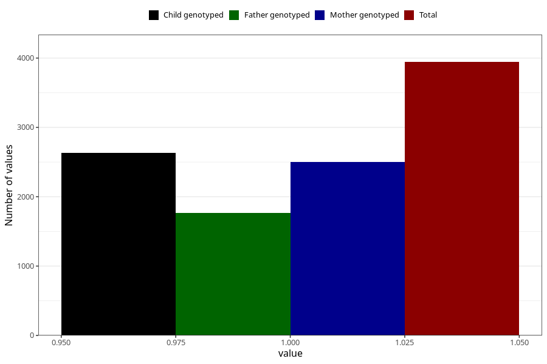

# neck_shoulder_pain_before_4w
Variable mapping to questionnaire: q1m, question AA206.
- Number of values:

| Value | Total | Child genotyped | Mother genotyped | Father genotyped |
| ----- | ----- | --------------- | ---------------- | ---------------- |
| Missing | 109680 | 72801 | 69267 | 48453 |
| Non-missing | 3943 | 2630 | 2502 | 1765 |
| 1 | 3943 | 2630 | 2502 | 1765 |

