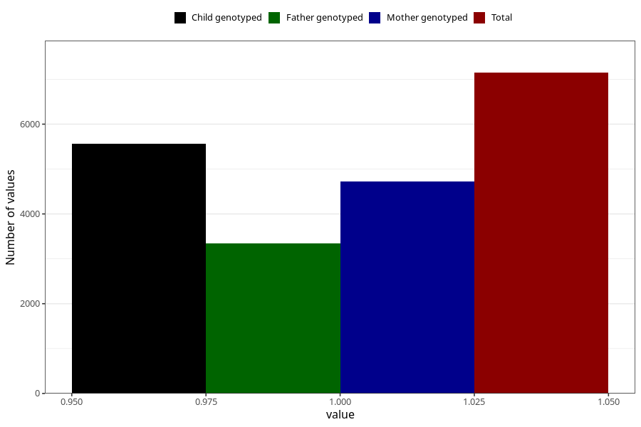

# other_muscle_joint_pain_21w_24w
Variable mapping to questionnaire: q3, question CC366.
- Number of values:

| Value | Total | Child genotyped | Mother genotyped | Father genotyped |
| ----- | ----- | --------------- | ---------------- | ---------------- |
| Missing | 106477 | 77799 | 67039 | 46881 |
| Non-missing | 7146 | 5556 | 4730 | 3337 |
| 1 | 7146 | 5556 | 4730 | 3337 |

