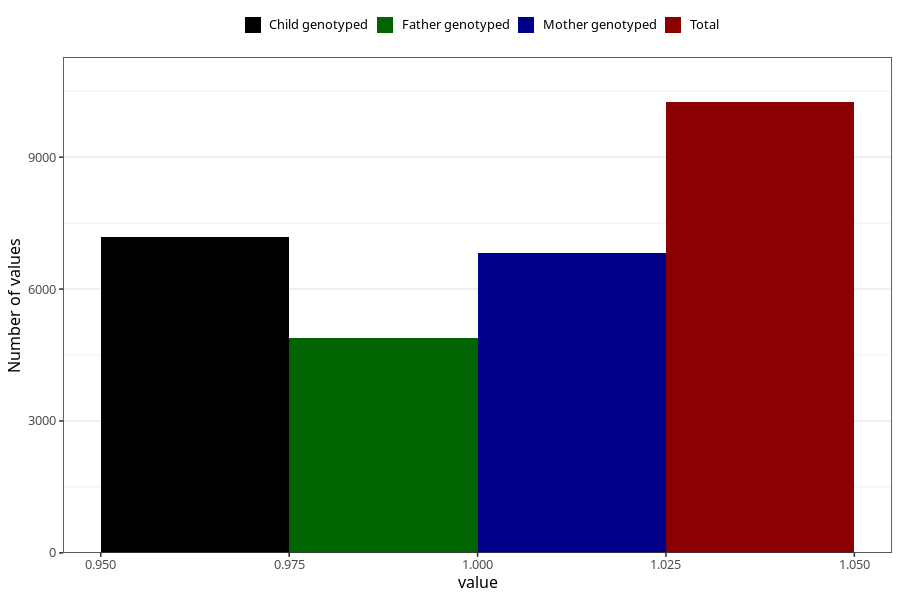

# other_muscle_joint_pain_25w_28w
Variable mapping to questionnaire: q3, question CC367.
- Number of values:

| Value | Total | Child genotyped | Mother genotyped | Father genotyped |
| ----- | ----- | --------------- | ---------------- | ---------------- |
| Missing | 103373 | 75362 | 64954 | 45331 |
| Non-missing | 10250 | 7993 | 6815 | 4887 |
| 1 | 10250 | 7993 | 6815 | 4887 |

