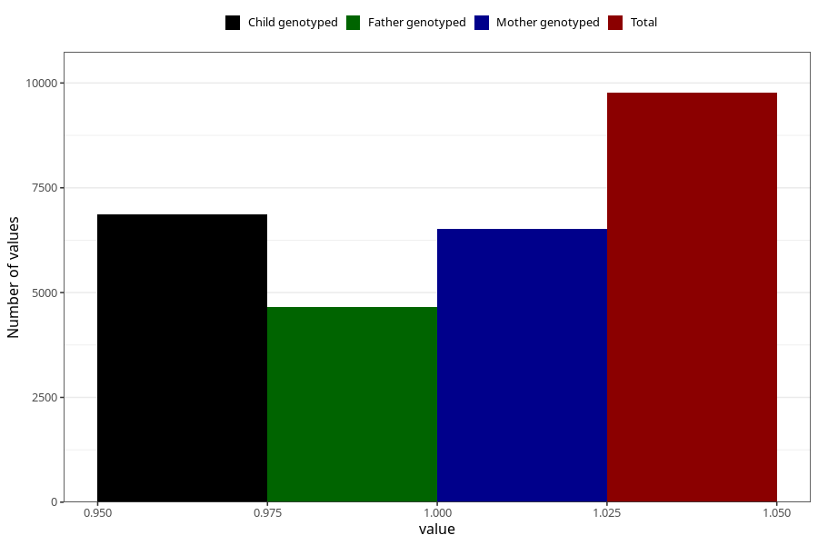

# other_muscle_joint_pain_after_29w
Variable mapping to questionnaire: q3, question CC368.
- Number of values:

| Value | Total | Child genotyped | Mother genotyped | Father genotyped |
| ----- | ----- | --------------- | ---------------- | ---------------- |
| Missing | 103858 | 75703 | 65252 | 45565 |
| Non-missing | 9765 | 7652 | 6517 | 4653 |
| 1 | 9765 | 7652 | 6517 | 4653 |

