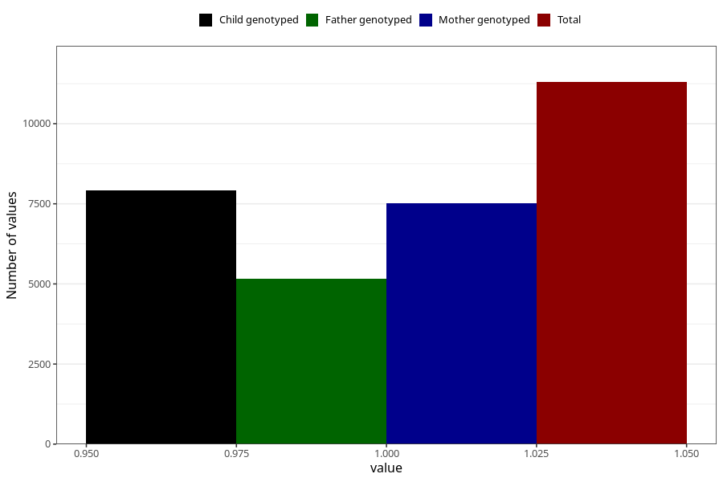

# pelvic_girdle_pain_13w_15w
Variable mapping to questionnaire: q1m, question AA179.
- Number of values:

| Value | Total | Child genotyped | Mother genotyped | Father genotyped |
| ----- | ----- | --------------- | ---------------- | ---------------- |
| Missing | 102325 | 67522 | 64240 | 45066 |
| Non-missing | 11298 | 7909 | 7529 | 5152 |
| 1 | 11298 | 7909 | 7529 | 5152 |

