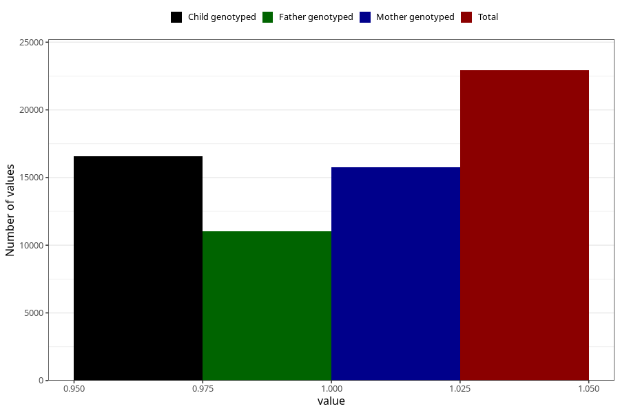

# pelvic_girdle_pain_21w_24w
Variable mapping to questionnaire: q3, question CC342.
- Number of values:

| Value | Total | Child genotyped | Mother genotyped | Father genotyped |
| ----- | ----- | --------------- | ---------------- | ---------------- |
| Missing | 90702 | 65193 | 56002 | 39202 |
| Non-missing | 22921 | 18162 | 15767 | 11016 |
| 1 | 22921 | 18162 | 15767 | 11016 |

