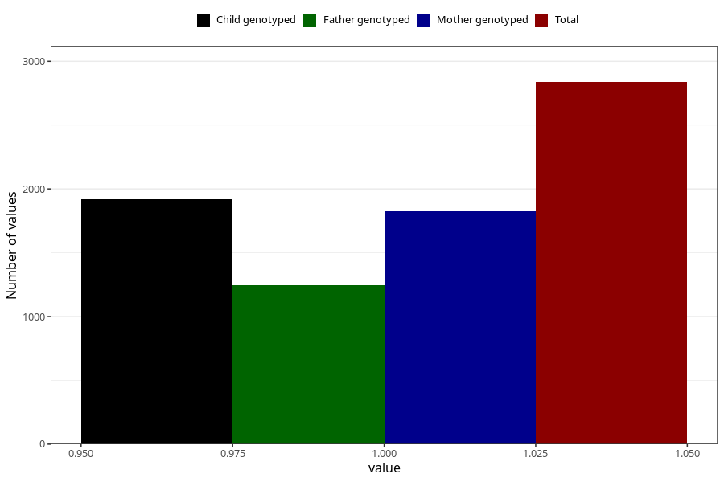

# pelvic_girdle_pain_5w_8w
Variable mapping to questionnaire: q1m, question AA177.
- Number of values:

| Value | Total | Child genotyped | Mother genotyped | Father genotyped |
| ----- | ----- | --------------- | ---------------- | ---------------- |
| Missing | 110786 | 73512 | 69942 | 48971 |
| Non-missing | 2837 | 1919 | 1827 | 1247 |
| 1 | 2837 | 1919 | 1827 | 1247 |

