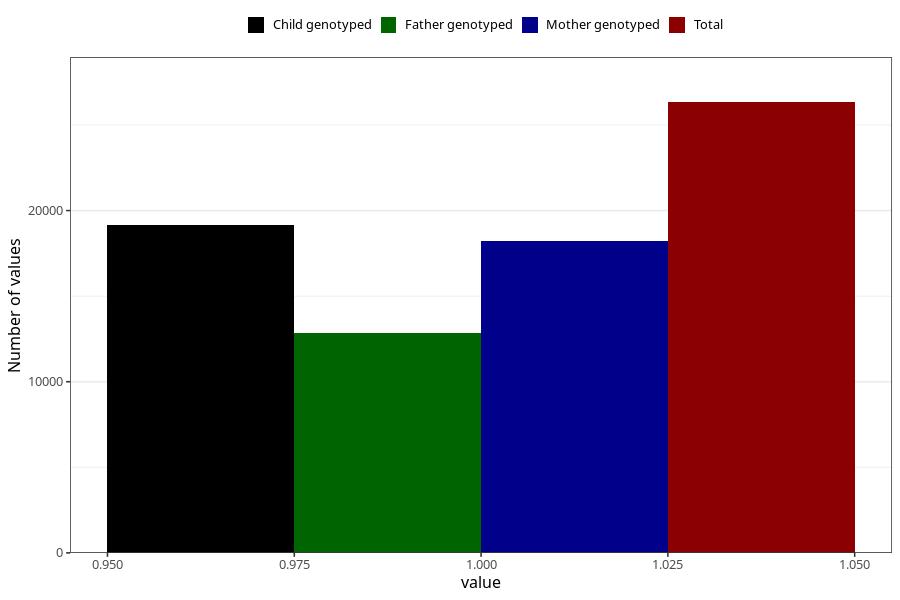

# pelvic_girdle_pain_after_29w
Variable mapping to questionnaire: q3, question CC344.
- Number of values:

| Value | Total | Child genotyped | Mother genotyped | Father genotyped |
| ----- | ----- | --------------- | ---------------- | ---------------- |
| Missing | 87291 | 62460 | 53566 | 37370 |
| Non-missing | 26332 | 20895 | 18203 | 12848 |
| 1 | 26332 | 20895 | 18203 | 12848 |

