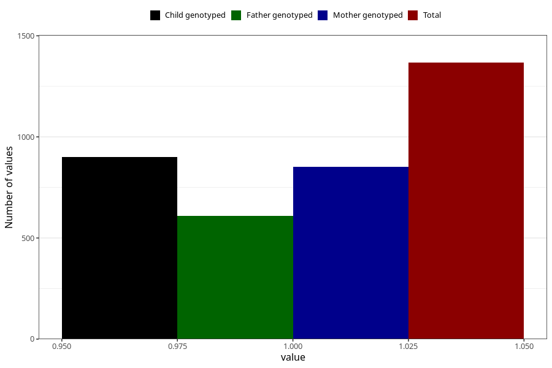

# pelvic_girdle_pain_before_4w
Variable mapping to questionnaire: q1m, question AA176.
- Number of values:

| Value | Total | Child genotyped | Mother genotyped | Father genotyped |
| ----- | ----- | --------------- | ---------------- | ---------------- |
| Missing | 112256 | 74530 | 70917 | 49609 |
| Non-missing | 1367 | 901 | 852 | 609 |
| 1 | 1367 | 901 | 852 | 609 |

