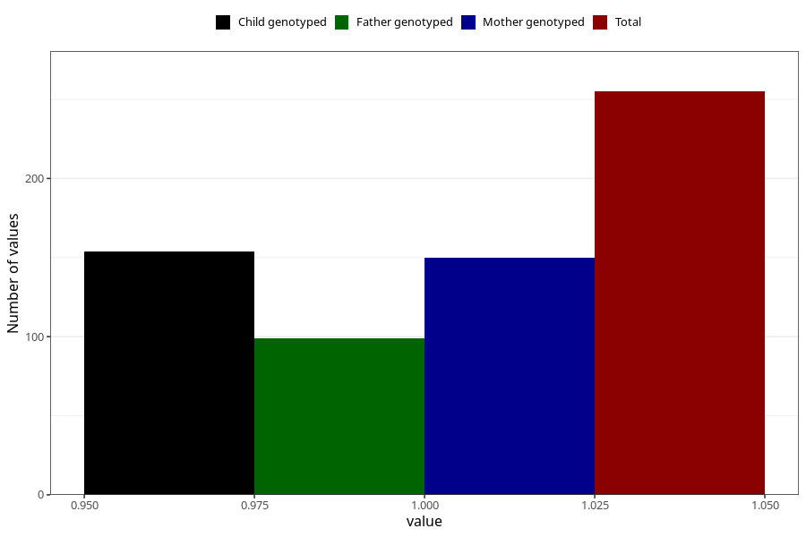

# pneumonia_bronchitis_before_4w
Variable mapping to questionnaire: q1m, question AA386.
- Number of values:

| Value | Total | Child genotyped | Mother genotyped | Father genotyped |
| ----- | ----- | --------------- | ---------------- | ---------------- |
| Missing | 113368 | 75277 | 71619 | 50119 |
| Non-missing | 255 | 154 | 150 | 99 |
| 1 | 255 | 154 | 150 | 99 |

