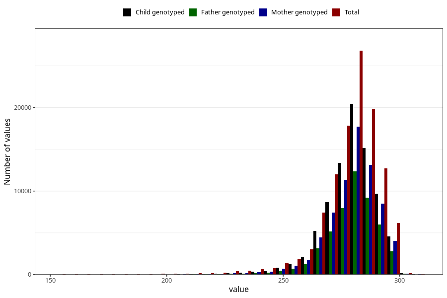

# pregnancy_duration
Variable mapping to questionnaire: mfr, question SVLEN_DG.
- Number of values:

| Value | Total | Child genotyped | Mother genotyped | Father genotyped |
| ----- | ----- | --------------- | ---------------- | ---------------- |
| Missing | 789 | 300 | 290 | 197 |
| Non-missing | 112834 | 75131 | 71479 | 50021 |
| 25th percentile | 273 | 274 | 274 | 274 |
| 50th percentile | 281 | 281 | 281 | 281 |
| 75th percentile | 287 | 287 | 287 | 287 |

