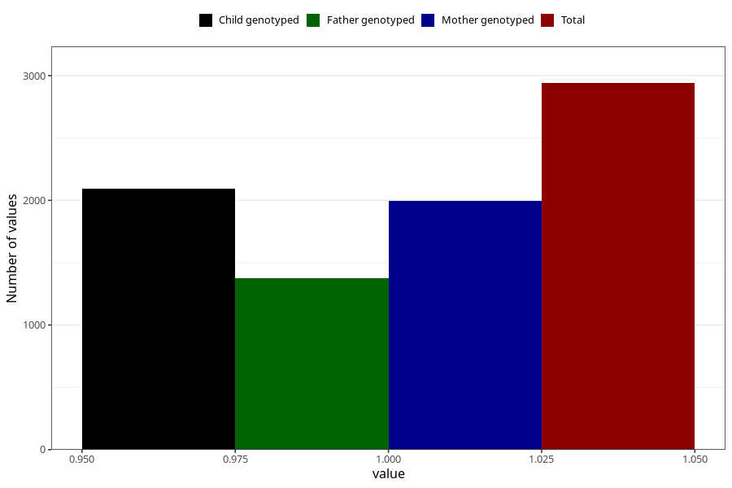

# pregnancy_itch_13w_16w
Variable mapping to questionnaire: q3, question CC424.
- Number of values:

| Value | Total | Child genotyped | Mother genotyped | Father genotyped |
| ----- | ----- | --------------- | ---------------- | ---------------- |
| Missing | 110683 | 81038 | 69771 | 48840 |
| Non-missing | 2940 | 2317 | 1998 | 1378 |
| 1 | 2940 | 2317 | 1998 | 1378 |

