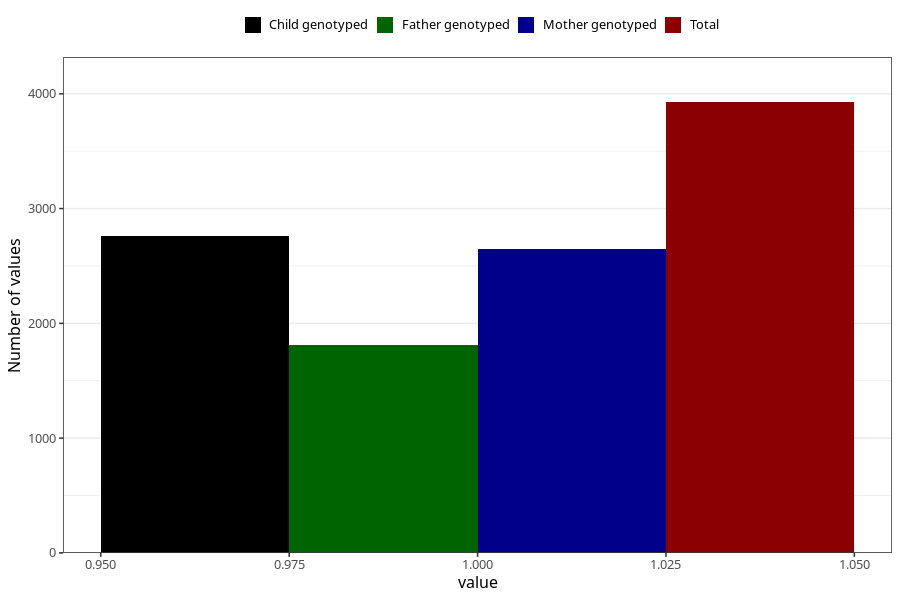

# pregnancy_itch_17w_20w
Variable mapping to questionnaire: q3, question CC425.
- Number of values:

| Value | Total | Child genotyped | Mother genotyped | Father genotyped |
| ----- | ----- | --------------- | ---------------- | ---------------- |
| Missing | 109696 | 80290 | 69124 | 48408 |
| Non-missing | 3927 | 3065 | 2645 | 1810 |
| 1 | 3927 | 3065 | 2645 | 1810 |

