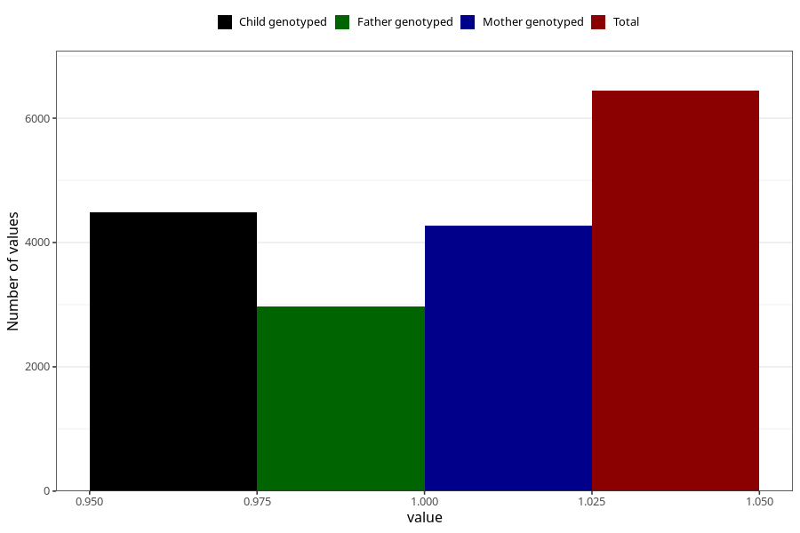

# pregnancy_itch_25w_28w
Variable mapping to questionnaire: q3, question CC427.
- Number of values:

| Value | Total | Child genotyped | Mother genotyped | Father genotyped |
| ----- | ----- | --------------- | ---------------- | ---------------- |
| Missing | 107182 | 78278 | 67495 | 47246 |
| Non-missing | 6441 | 5077 | 4274 | 2972 |
| 1 | 6441 | 5077 | 4274 | 2972 |

