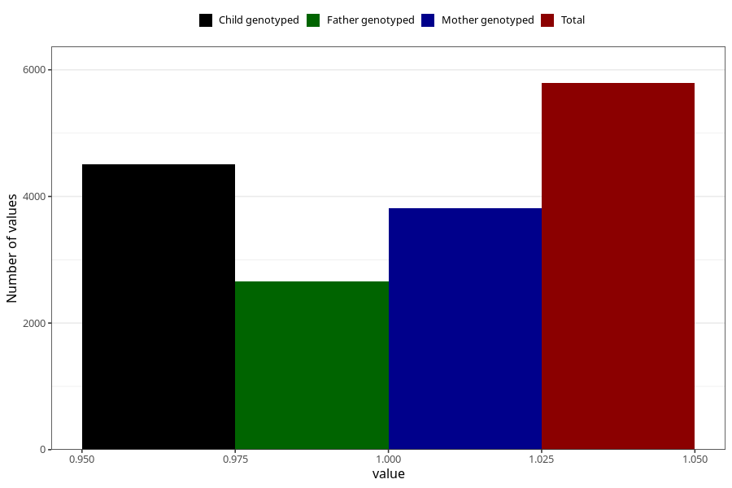

# pregnancy_itch_after_29w
Variable mapping to questionnaire: q3, question CC428.
- Number of values:

| Value | Total | Child genotyped | Mother genotyped | Father genotyped |
| ----- | ----- | --------------- | ---------------- | ---------------- |
| Missing | 107833 | 71456 | 67956 | 47565 |
| Non-missing | 5790 | 3975 | 3813 | 2653 |
| 1 | 5790 | 3975 | 3813 | 2653 |

