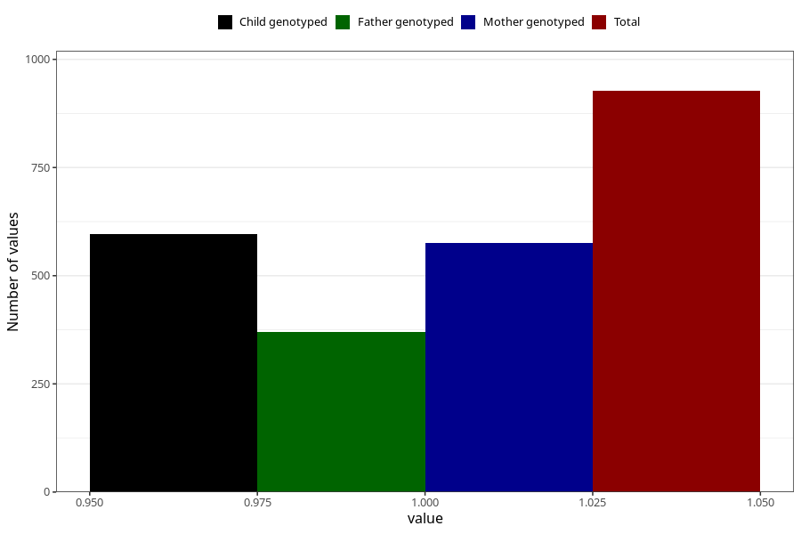

# pregnancy_itch_before_4w
Variable mapping to questionnaire: q1m, question AA256.
- Number of values:

| Value | Total | Child genotyped | Mother genotyped | Father genotyped |
| ----- | ----- | --------------- | ---------------- | ---------------- |
| Missing | 112696 | 74834 | 71194 | 49848 |
| Non-missing | 927 | 597 | 575 | 370 |
| 1 | 927 | 597 | 575 | 370 |

