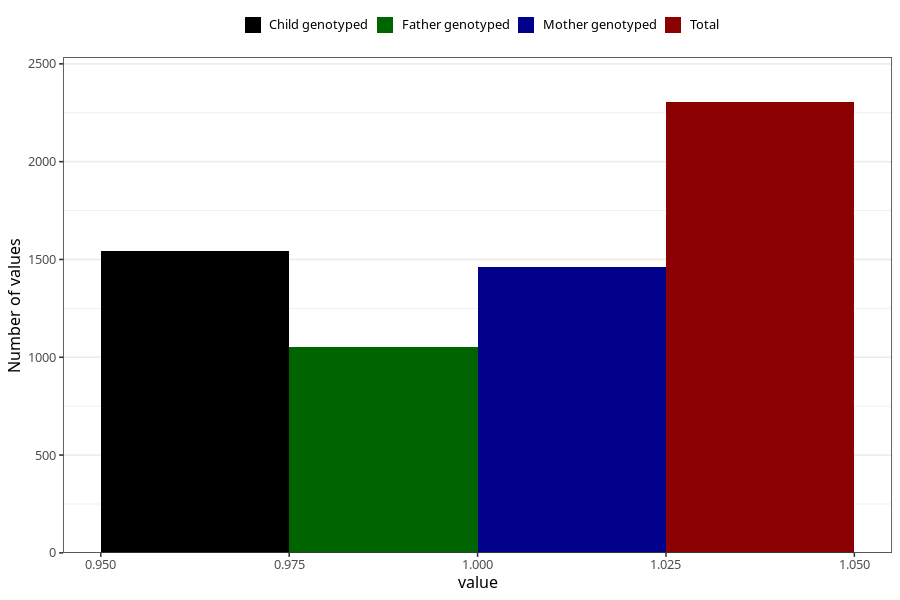

# protein_in_urine_13w_15w
Variable mapping to questionnaire: q1m, question AA409.
- Number of values:

| Value | Total | Child genotyped | Mother genotyped | Father genotyped |
| ----- | ----- | --------------- | ---------------- | ---------------- |
| Missing | 111319 | 73888 | 70309 | 49167 |
| Non-missing | 2304 | 1543 | 1460 | 1051 |
| 1 | 2304 | 1543 | 1460 | 1051 |

