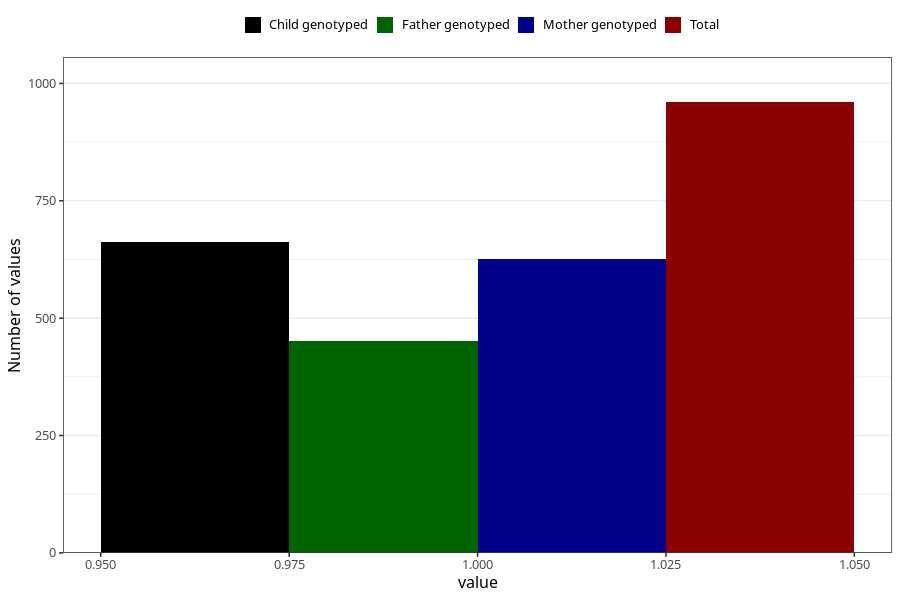

# protein_in_urine_5w_8w
Variable mapping to questionnaire: q1m, question AA407.
- Number of values:

| Value | Total | Child genotyped | Mother genotyped | Father genotyped |
| ----- | ----- | --------------- | ---------------- | ---------------- |
| Missing | 112663 | 82631 | 71142 | 49767 |
| Non-missing | 960 | 724 | 627 | 451 |
| 1 | 960 | 724 | 627 | 451 |

