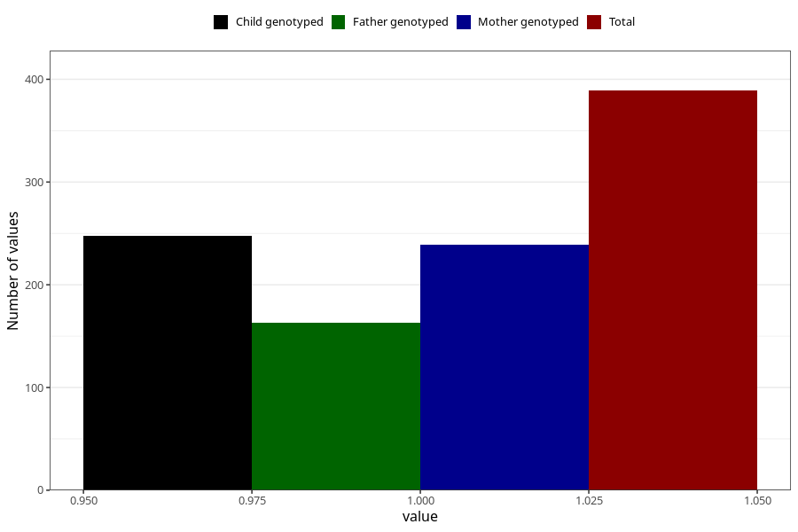

# sugar_in_urine_5w_8w
Variable mapping to questionnaire: q1m, question AA397.
- Number of values:

| Value | Total | Child genotyped | Mother genotyped | Father genotyped |
| ----- | ----- | --------------- | ---------------- | ---------------- |
| Missing | 113234 | 75183 | 71530 | 50055 |
| Non-missing | 389 | 248 | 239 | 163 |
| 1 | 389 | 248 | 239 | 163 |

