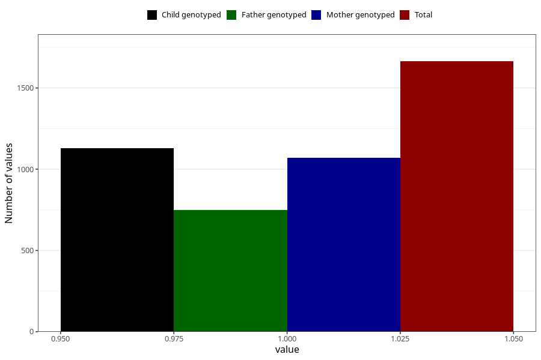

# throat_infection_13w_15w
Variable mapping to questionnaire: q1m, question AA359.
- Number of values:

| Value | Total | Child genotyped | Mother genotyped | Father genotyped |
| ----- | ----- | --------------- | ---------------- | ---------------- |
| Missing | 111959 | 74303 | 70697 | 49469 |
| Non-missing | 1664 | 1128 | 1072 | 749 |
| 1 | 1664 | 1128 | 1072 | 749 |

