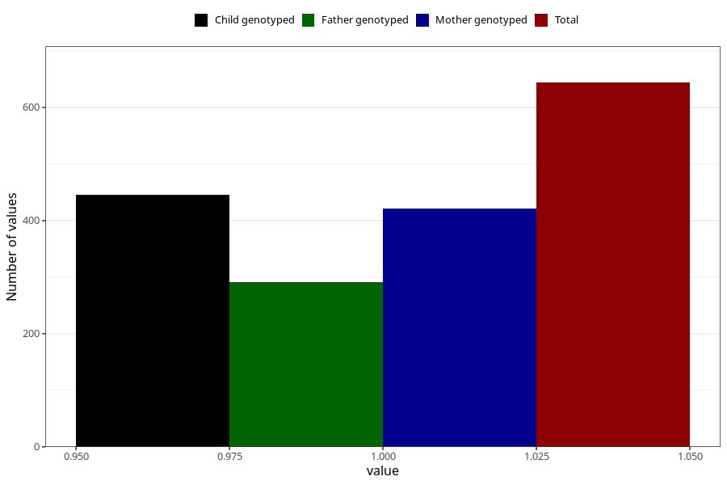

# throat_infection_before_4w
Variable mapping to questionnaire: q1m, question AA356.
- Number of values:

| Value | Total | Child genotyped | Mother genotyped | Father genotyped |
| ----- | ----- | --------------- | ---------------- | ---------------- |
| Missing | 112979 | 74986 | 71348 | 49926 |
| Non-missing | 644 | 445 | 421 | 292 |
| 1 | 644 | 445 | 421 | 292 |

