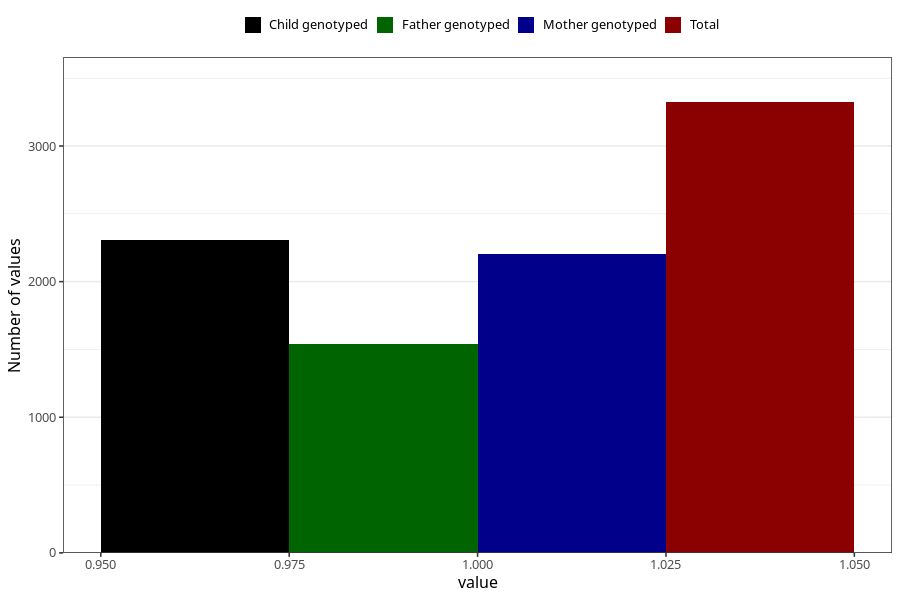

# vaginal_bleeding_1_13w_16w
Variable mapping to questionnaire: q3, question CC317.
- Number of values:

| Value | Total | Child genotyped | Mother genotyped | Father genotyped |
| ----- | ----- | --------------- | ---------------- | ---------------- |
| Missing | 110300 | 73124 | 69567 | 48680 |
| Non-missing | 3323 | 2307 | 2202 | 1538 |
| 1 | 3323 | 2307 | 2202 | 1538 |

