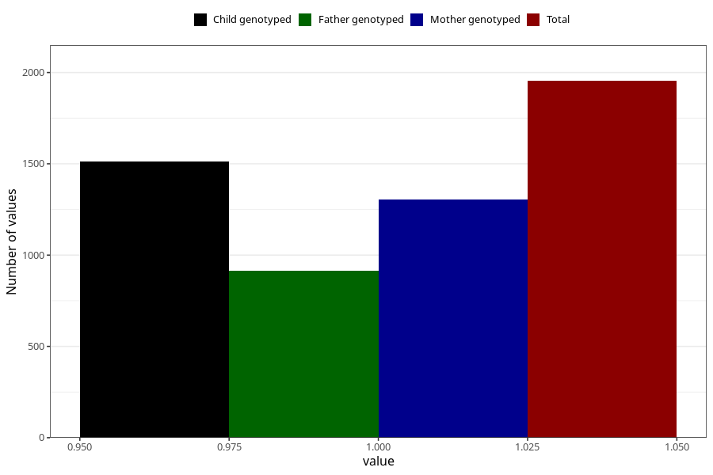

# vaginal_bleeding_1_17w_20w
Variable mapping to questionnaire: q3, question CC318.
- Number of values:

| Value | Total | Child genotyped | Mother genotyped | Father genotyped |
| ----- | ----- | --------------- | ---------------- | ---------------- |
| Missing | 111669 | 81842 | 70463 | 49304 |
| Non-missing | 1954 | 1513 | 1306 | 914 |
| 1 | 1954 | 1513 | 1306 | 914 |

