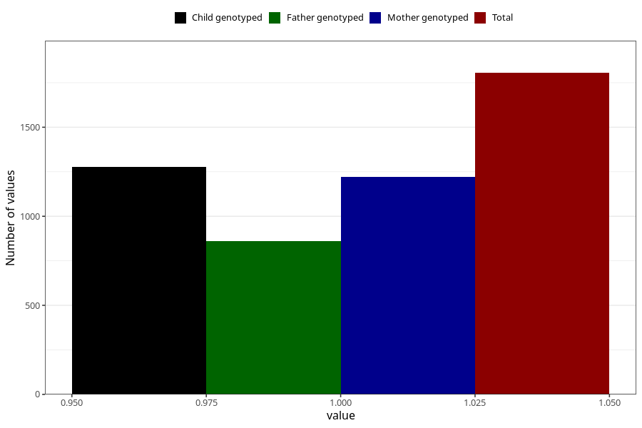

# vaginal_bleeding_1_21w_24w
Variable mapping to questionnaire: q3, question CC319.
- Number of values:

| Value | Total | Child genotyped | Mother genotyped | Father genotyped |
| ----- | ----- | --------------- | ---------------- | ---------------- |
| Missing | 111818 | 81941 | 70547 | 49357 |
| Non-missing | 1805 | 1414 | 1222 | 861 |
| 1 | 1805 | 1414 | 1222 | 861 |

