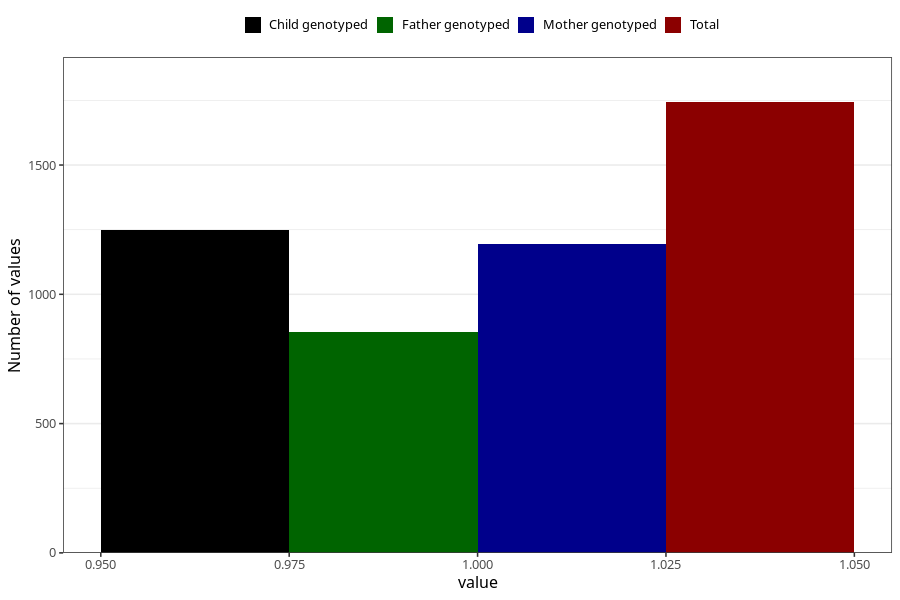

# vaginal_bleeding_1_25w_28w
Variable mapping to questionnaire: q3, question CC320.
- Number of values:

| Value | Total | Child genotyped | Mother genotyped | Father genotyped |
| ----- | ----- | --------------- | ---------------- | ---------------- |
| Missing | 111880 | 74184 | 70576 | 49364 |
| Non-missing | 1743 | 1247 | 1193 | 854 |
| 1 | 1743 | 1247 | 1193 | 854 |

