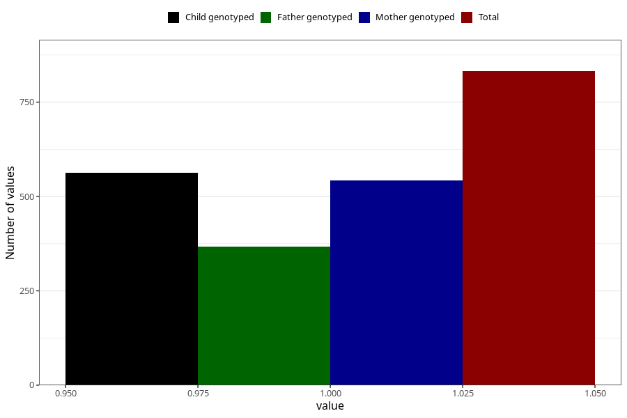

# vaginal_bleeding_1_after_29w
Variable mapping to questionnaire: q3, question CC321.
- Number of values:

| Value | Total | Child genotyped | Mother genotyped | Father genotyped |
| ----- | ----- | --------------- | ---------------- | ---------------- |
| Missing | 112791 | 82721 | 71227 | 49851 |
| Non-missing | 832 | 634 | 542 | 367 |
| 1 | 832 | 634 | 542 | 367 |

