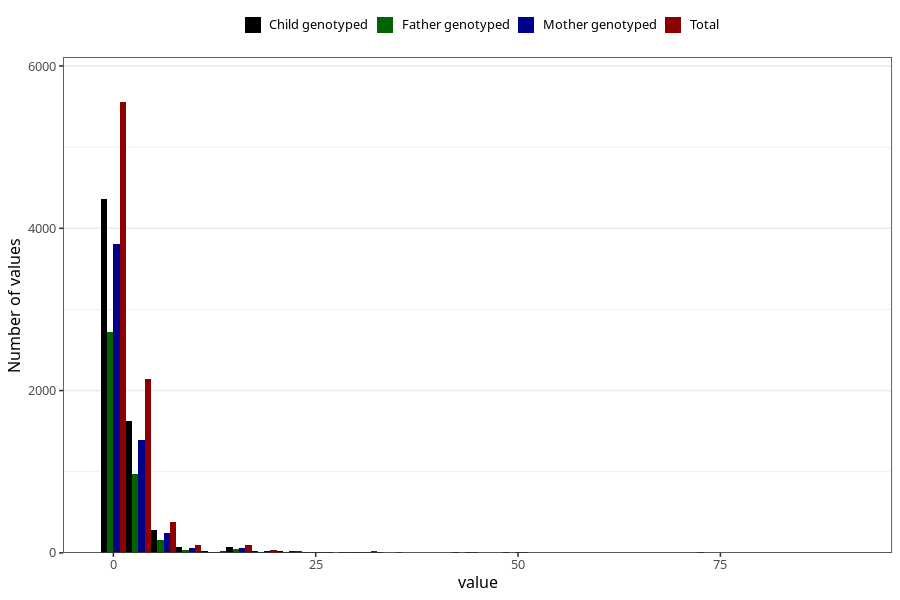

# vaginal_bleeding_1_duration
Variable mapping to questionnaire: q3, question CC322.
- Number of values:

| Value | Total | Child genotyped | Mother genotyped | Father genotyped |
| ----- | ----- | --------------- | ---------------- | ---------------- |
| Missing | 105177 | 76809 | 66086 | 46205 |
| Non-missing | 8446 | 6546 | 5683 | 4013 |
| 25th percentile | 1 | 1 | 1 | 1 |
| 50th percentile | 1 | 1 | 1 | 1 |
| 75th percentile | 2 | 2 | 2 | 2 |

