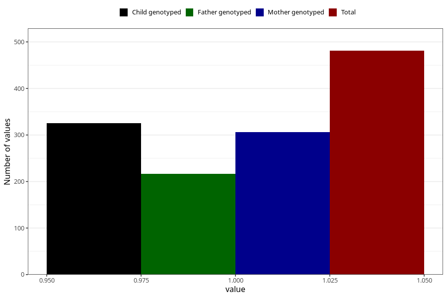

# vaginal_bleeding_2_13w_16w
Variable mapping to questionnaire: q3, question CC324.
- Number of values:

| Value | Total | Child genotyped | Mother genotyped | Father genotyped |
| ----- | ----- | --------------- | ---------------- | ---------------- |
| Missing | 113142 | 75106 | 71463 | 50001 |
| Non-missing | 481 | 325 | 306 | 217 |
| 1 | 481 | 325 | 306 | 217 |

