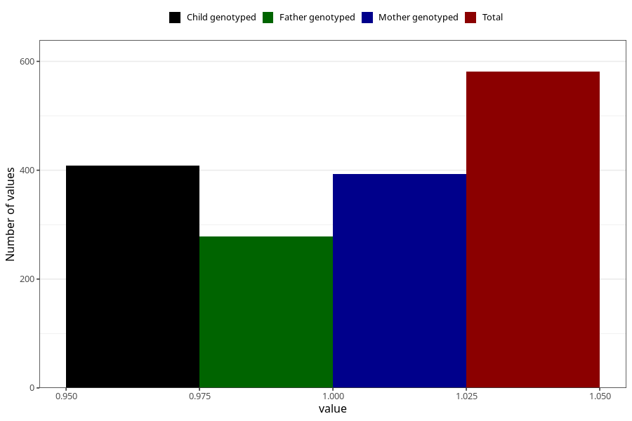

# vaginal_bleeding_2_21w_24w
Variable mapping to questionnaire: q3, question CC326.
- Number of values:

| Value | Total | Child genotyped | Mother genotyped | Father genotyped |
| ----- | ----- | --------------- | ---------------- | ---------------- |
| Missing | 113042 | 82899 | 71376 | 49940 |
| Non-missing | 581 | 456 | 393 | 278 |
| 1 | 581 | 456 | 393 | 278 |

