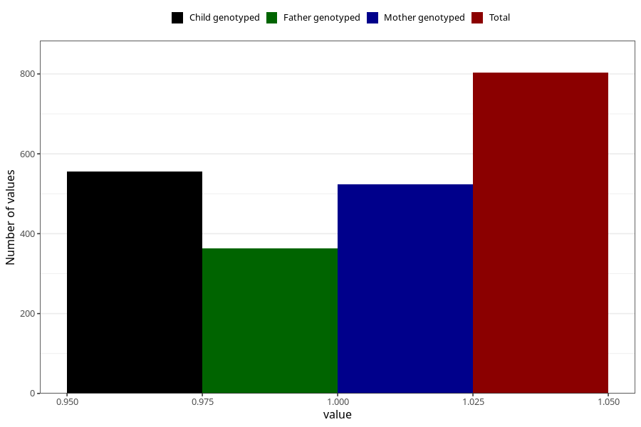

# vaginal_bleeding_2_25w_28w
Variable mapping to questionnaire: q3, question CC327.
- Number of values:

| Value | Total | Child genotyped | Mother genotyped | Father genotyped |
| ----- | ----- | --------------- | ---------------- | ---------------- |
| Missing | 112820 | 82753 | 71246 | 49854 |
| Non-missing | 803 | 602 | 523 | 364 |
| 1 | 803 | 602 | 523 | 364 |

