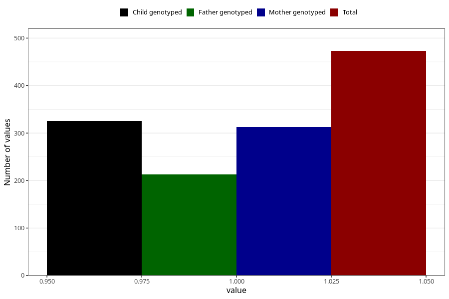

# vaginal_bleeding_2_after_29w
Variable mapping to questionnaire: q3, question CC328.
- Number of values:

| Value | Total | Child genotyped | Mother genotyped | Father genotyped |
| ----- | ----- | --------------- | ---------------- | ---------------- |
| Missing | 113150 | 75106 | 71456 | 50005 |
| Non-missing | 473 | 325 | 313 | 213 |
| 1 | 473 | 325 | 313 | 213 |

