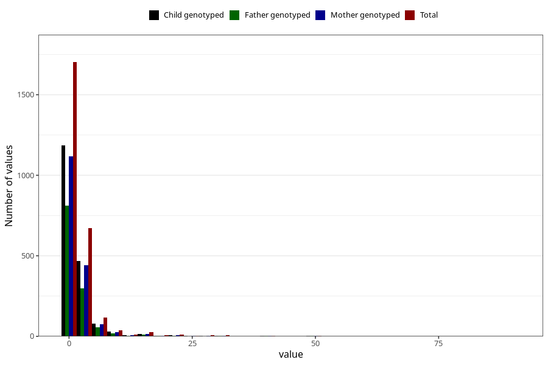

# vaginal_bleeding_2_duration
Variable mapping to questionnaire: q3, question CC329.
- Number of values:

| Value | Total | Child genotyped | Mother genotyped | Father genotyped |
| ----- | ----- | --------------- | ---------------- | ---------------- |
| Missing | 111012 | 73620 | 70055 | 49004 |
| Non-missing | 2611 | 1811 | 1714 | 1214 |
| 25th percentile | 1 | 1 | 1 | 1 |
| 50th percentile | 1 | 1 | 1 | 1 |
| 75th percentile | 2 | 2 | 2 | 2 |

