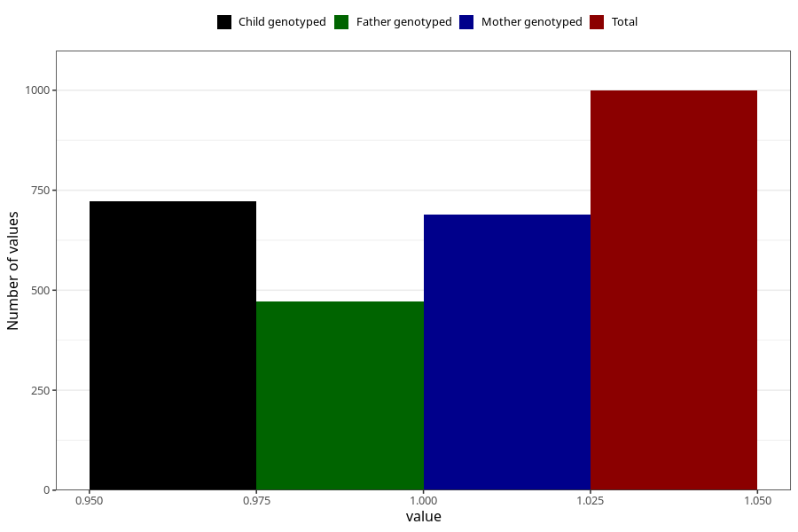

# vaginal_bleeding_know_why_cervical_ulcer_mucous_bleeding
Variable mapping to questionnaire: q3, question CC336.
- Number of values:

| Value | Total | Child genotyped | Mother genotyped | Father genotyped |
| ----- | ----- | --------------- | ---------------- | ---------------- |
| Missing | 112624 | 74708 | 71080 | 49746 |
| Non-missing | 999 | 723 | 689 | 472 |
| 1 | 999 | 723 | 689 | 472 |

