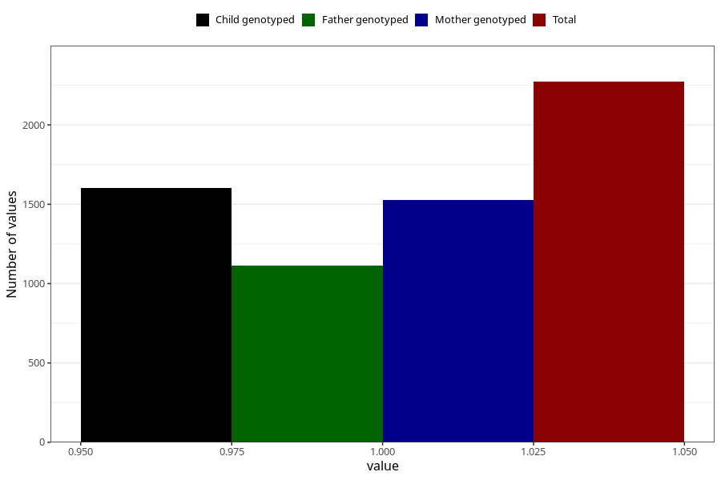

# vaginal_bleeding_know_why_intercourse
Variable mapping to questionnaire: q3, question CC337.
- Number of values:

| Value | Total | Child genotyped | Mother genotyped | Father genotyped |
| ----- | ----- | --------------- | ---------------- | ---------------- |
| Missing | 111351 | 73831 | 70243 | 49103 |
| Non-missing | 2272 | 1600 | 1526 | 1115 |
| 1 | 2272 | 1600 | 1526 | 1115 |

