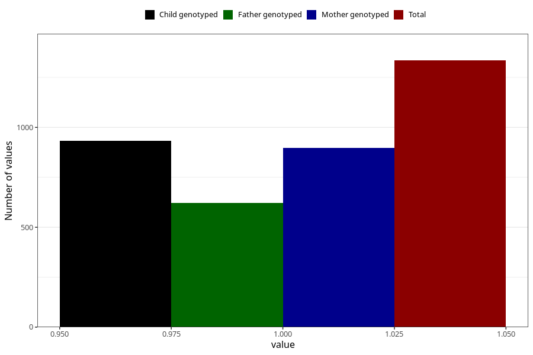

# vaginal_bleeding_know_why_other
Variable mapping to questionnaire: q3, question CC338.
- Number of values:

| Value | Total | Child genotyped | Mother genotyped | Father genotyped |
| ----- | ----- | --------------- | ---------------- | ---------------- |
| Missing | 112288 | 82310 | 70873 | 49595 |
| Non-missing | 1335 | 1045 | 896 | 623 |
| 1 | 1335 | 1045 | 896 | 623 |

