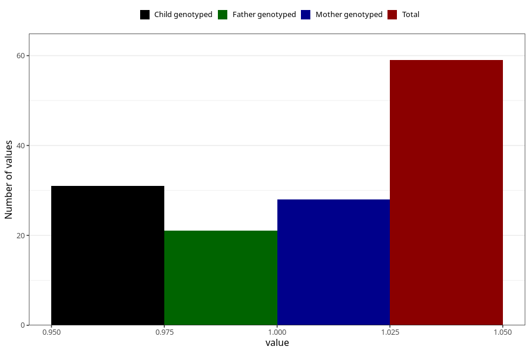

# vaginal_bleeding_know_why_placenta_separation
Variable mapping to questionnaire: q3, question CC334.
- Number of values:

| Value | Total | Child genotyped | Mother genotyped | Father genotyped |
| ----- | ----- | --------------- | ---------------- | ---------------- |
| Missing | 113564 | 75400 | 71741 | 50197 |
| Non-missing | 59 | 31 | 28 | 21 |
| 1 | 59 | 31 | 28 | 21 |

