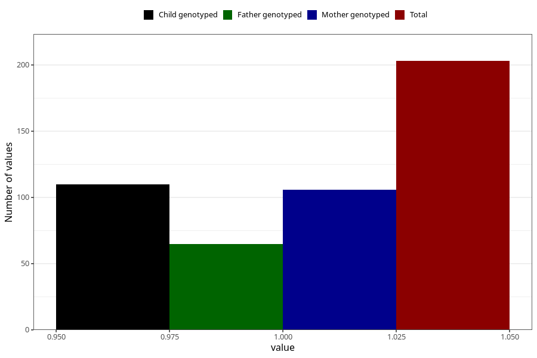

# vaginal_bleeding_know_why_threatening_miscarriage_premature_birth
Variable mapping to questionnaire: q3, question CC335.
- Number of values:

| Value | Total | Child genotyped | Mother genotyped | Father genotyped |
| ----- | ----- | --------------- | ---------------- | ---------------- |
| Missing | 113420 | 75321 | 71663 | 50153 |
| Non-missing | 203 | 110 | 106 | 65 |
| 1 | 203 | 110 | 106 | 65 |

