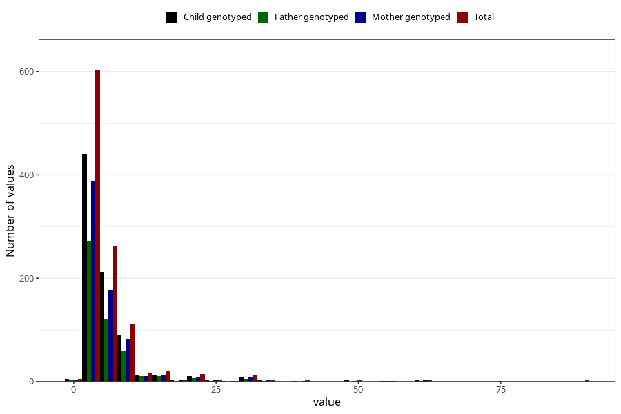

# vaginal_bleeding_more_than_two_episodes_n
Variable mapping to questionnaire: q3, question CC331.
- Number of values:

| Value | Total | Child genotyped | Mother genotyped | Father genotyped |
| ----- | ----- | --------------- | ---------------- | ---------------- |
| Missing | 112558 | 74695 | 71068 | 49728 |
| Non-missing | 1065 | 736 | 701 | 490 |
| 25th percentile | 3 | 3 | 3 | 3 |
| 50th percentile | 4 | 4 | 4 | 4 |
| 75th percentile | 6 | 6 | 6 | 6 |

