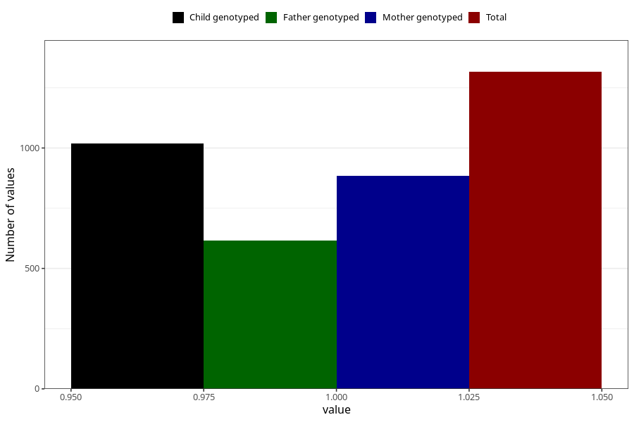

# vaginal_catarrh_unusual_discharge_13w_16w
Variable mapping to questionnaire: q3, question CC412.
- Number of values:

| Value | Total | Child genotyped | Mother genotyped | Father genotyped |
| ----- | ----- | --------------- | ---------------- | ---------------- |
| Missing | 112307 | 74509 | 70884 | 49602 |
| Non-missing | 1316 | 922 | 885 | 616 |
| 1 | 1316 | 922 | 885 | 616 |

