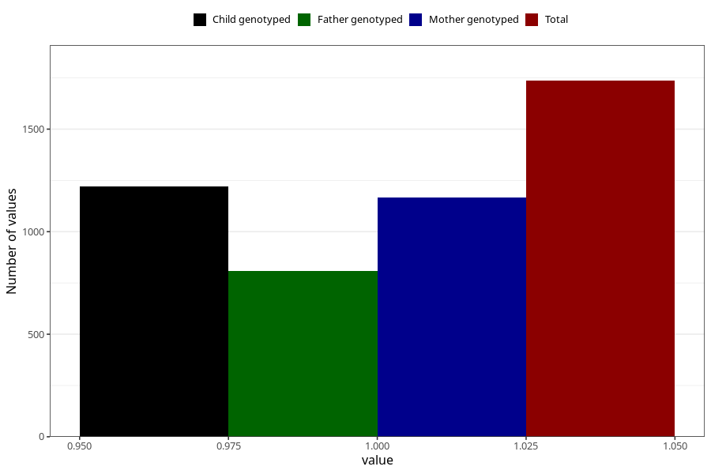

# vaginal_catarrh_unusual_discharge_17w_20w
Variable mapping to questionnaire: q3, question CC413.
- Number of values:

| Value | Total | Child genotyped | Mother genotyped | Father genotyped |
| ----- | ----- | --------------- | ---------------- | ---------------- |
| Missing | 111887 | 81999 | 70602 | 49410 |
| Non-missing | 1736 | 1356 | 1167 | 808 |
| 1 | 1736 | 1356 | 1167 | 808 |

