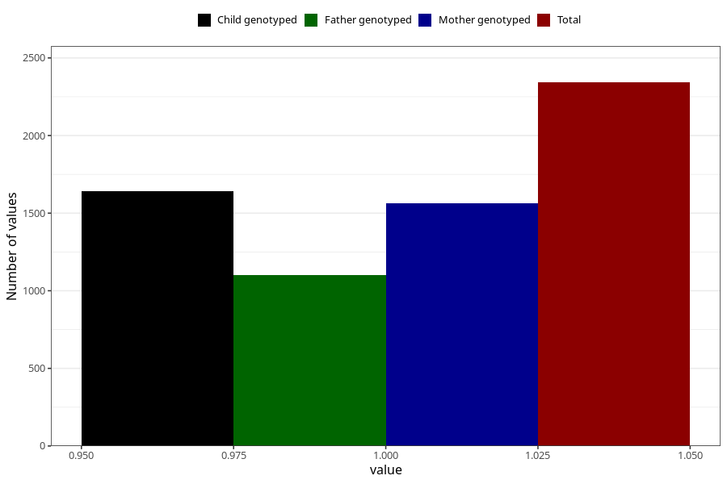

# vaginal_catarrh_unusual_discharge_21w_24w
Variable mapping to questionnaire: q3, question CC414.
- Number of values:

| Value | Total | Child genotyped | Mother genotyped | Father genotyped |
| ----- | ----- | --------------- | ---------------- | ---------------- |
| Missing | 111281 | 81530 | 70206 | 49117 |
| Non-missing | 2342 | 1825 | 1563 | 1101 |
| 1 | 2342 | 1825 | 1563 | 1101 |

