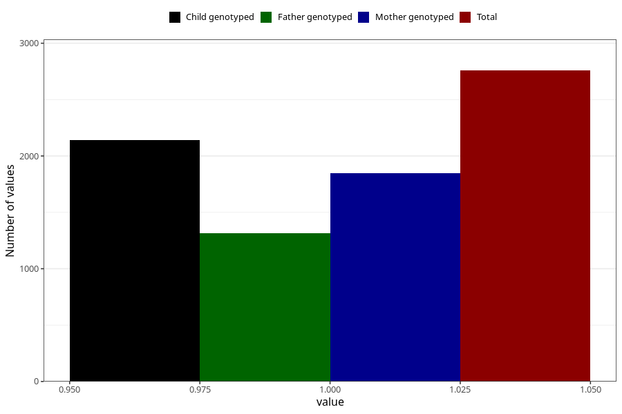

# vaginal_catarrh_unusual_discharge_25w_28w
Variable mapping to questionnaire: q3, question CC415.
- Number of values:

| Value | Total | Child genotyped | Mother genotyped | Father genotyped |
| ----- | ----- | --------------- | ---------------- | ---------------- |
| Missing | 110865 | 73486 | 69919 | 48904 |
| Non-missing | 2758 | 1945 | 1850 | 1314 |
| 1 | 2758 | 1945 | 1850 | 1314 |

