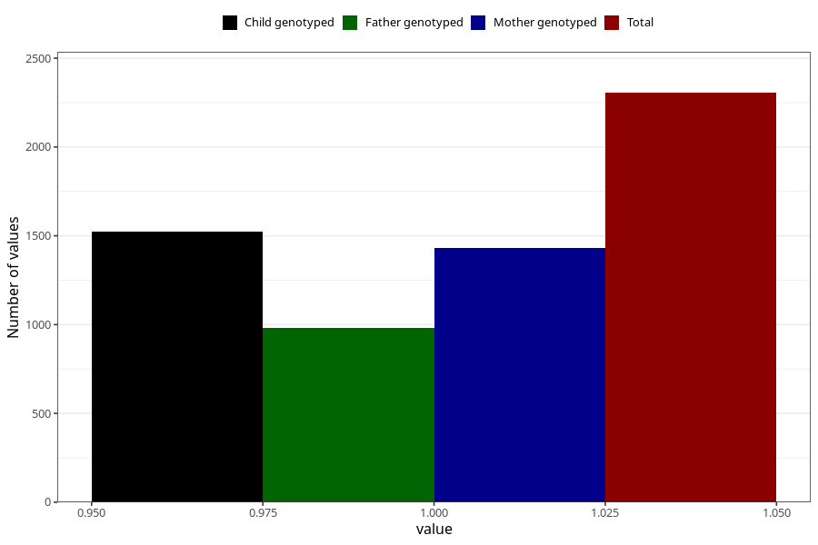

# vaginal_catarrh_unusual_discharge_5w_8w
Variable mapping to questionnaire: q1m, question AA247.
- Number of values:

| Value | Total | Child genotyped | Mother genotyped | Father genotyped |
| ----- | ----- | --------------- | ---------------- | ---------------- |
| Missing | 111318 | 81659 | 70336 | 49236 |
| Non-missing | 2305 | 1696 | 1433 | 982 |
| 1 | 2305 | 1696 | 1433 | 982 |

