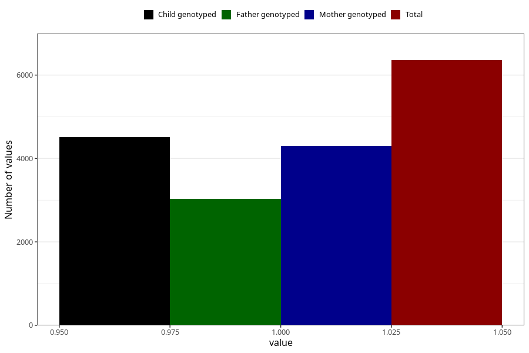

# vaginal_thrush_13w_16w
Variable mapping to questionnaire: q3, question CC400.
- Number of values:

| Value | Total | Child genotyped | Mother genotyped | Father genotyped |
| ----- | ----- | --------------- | ---------------- | ---------------- |
| Missing | 107264 | 70918 | 67462 | 47187 |
| Non-missing | 6359 | 4513 | 4307 | 3031 |
| 1 | 6359 | 4513 | 4307 | 3031 |

