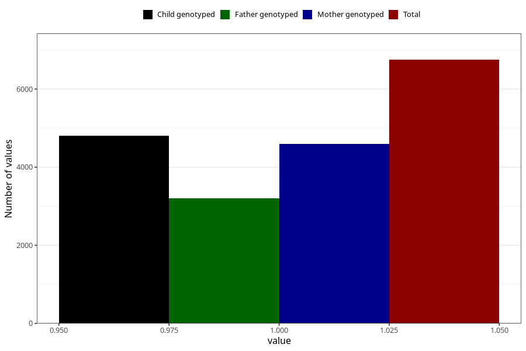

# vaginal_thrush_17w_20w
Variable mapping to questionnaire: q3, question CC401.
- Number of values:

| Value | Total | Child genotyped | Mother genotyped | Father genotyped |
| ----- | ----- | --------------- | ---------------- | ---------------- |
| Missing | 106874 | 70624 | 67167 | 47018 |
| Non-missing | 6749 | 4807 | 4602 | 3200 |
| 1 | 6749 | 4807 | 4602 | 3200 |

